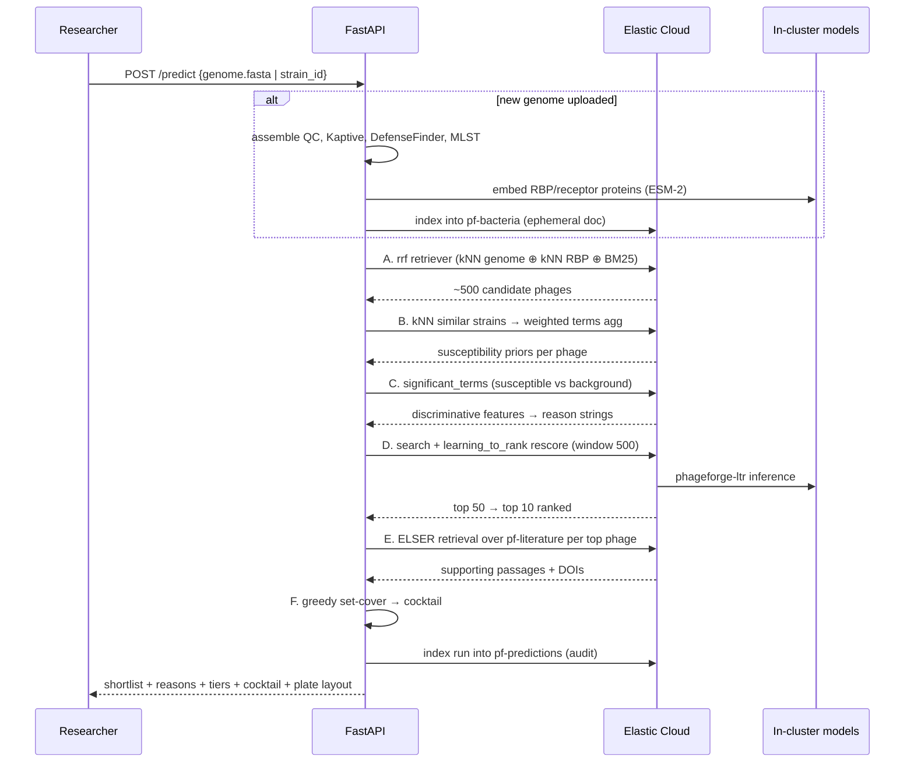

# PhageForge — System Architecture

> **Status:** design document, pre-implementation
> **Audience:** build team
> **Companion docs:** [`TECHNICAL_DESIGN.md`](./TECHNICAL_DESIGN.md) (goals, plan, benchmark) · [`SOLUTION_OVERVIEW.md`](./SOLUTION_OVERVIEW.md) (non-technical review doc)

---

## 1. Problem statement

Bacteriophages kill bacteria with **strain-level** specificity: a phage that lyses *E. coli* strain A may be completely inert against strain B of the same species. When a clinical or environmental isolate arrives with unknown phage susceptibility, the only reliable answer today is brute-force wet-lab screening — plaque assays across every available phage.

The combinatorics are the problem. Gaborieau et al. (*Nature Microbiology*, 2024) measured **38,688 phage–bacteria pairs (403 Escherichia strains × 96 phages)** to characterise a single genus. A biobank holding 10,000 phages and facing 5,000 uncharacterised strains implies a 50-million-cell matrix that will never be filled experimentally.

```
                            PHAGES
                P1    P2    P3    P4   ...   P10000
        B1  ┌───?─────?─────?─────?─────────────?───┐
        B2  │   ?     ?     ?     ?             ?   │
        B3  │   ?     ?     ?     ?             ?   │   50,000,000 cells
        ... │   ?     ?     ?     ?             ?   │   ~40,000 measured
      B5000 └───?─────?─────?─────?─────────────?───┘
```

**What PhageForge does.** Given the genome of an uncharacterised bacterial strain, it reduces ~10,000 candidate phages to a ranked, evidence-backed shortlist of ~10 worth testing at the bench, each carrying a stated biological reason and a provenance tier, plus a designed multi-phage cocktail.

**What PhageForge is not.** It is a **research prioritisation tool, not a clinical treatment recommender**. It reorders an experimental queue; it does not replace plaque assays, and it makes no claim about *in vivo* efficacy.

---

## 2. Why Elasticsearch is load-bearing, not a datastore

This is the central architectural claim and it rests on a biological fact.

The headline finding of the Gaborieau work is that **adsorption factors dominate**: whether a phage's receptor-binding protein (RBP) can engage a bacterium's surface receptor (capsule/K-locus, O-antigen, LPS, outer-membrane proteins) explains most of the interaction signal, while antiphage defence systems contribute marginally.

"Does this phage's RBP match this strain's surface receptor?" is a **similarity-search problem**, not a deep-model problem. That maps natively onto Elasticsearch primitives, so every stage of the funnel is an Elastic operation rather than a Python computation over rows Elastic happens to store:

| Funnel stage | Elastic mechanism | Not this |
|---|---|---|
| Candidate generation | `rrf` retriever fusing kNN(genome sketch) + kNN(RBP↔receptor protein) + BM25(annotations) | `SELECT * WHERE species=…` |
| Susceptibility prior | kNN → top-K similar strains → similarity-weighted `terms` agg over observed interactions | pandas groupby |
| Explanation | `significant_terms` agg over K-locus / O-antigen / defence systems | post-hoc SHAP |
| Final ranking | `learning_to_rank` rescorer (XGBRanker, deployed in-cluster) | scikit-learn in FastAPI |
| Evidence | ELSER / `semantic_text` retrieval over Europe PMC OA full text | keyword grep |
| NL interface | Agent Builder with ES\|QL tools | bespoke prompt plumbing |

If you removed Elasticsearch from this design, you would have to rebuild vector search, hybrid fusion, statistical aggregation, in-cluster model inference, and semantic retrieval. That is the test of load-bearing.

---

## 3. System diagram

```
┌─ OFFLINE INGEST (Python, run once + scheduled refresh) ────────────────────┐
│                                                                            │
│  Zenodo 13831957        PhageHostLearn           INPHARED / PhageScope     │
│  403×96 matrix          Zenodo 11061100          ~30k annotated phage      │
│  + genomes (146.8 MB)   Klebsiella + RBPs        genomes, MASH sketches    │
│         │                     │                        │                   │
│  MVP · Virus-Host DB     NCBI · BV-BRC           Europe PMC OA REST        │
│  bulk interactions       bacterial genomes       full-text literature      │
│         └─────────────────────┴────────────────────────┘                   │
│                               ▼                                            │
│                    FEATURE EXTRACTION                                      │
│   Bacteria │ MLST/ST · K-locus (Kaptive 2.x) · O-antigen & LPS loci        │
│            │ defence systems (DefenseFinder / PADLOC) · AMR (AMRFinderPlus)│
│   Phage    │ lifestyle (BACPHLIP) · ICTV taxonomy                          │
│            │ RBPs (PhageRBPdetect 2.x) · depolymerases                     │
│   Vectors  │ ESM-2 650M → 1280-dim embeddings of RBP + receptor proteins   │
│            │ MinHash/k-mer genome sketches → 256-dim (cheap tier)          │
└───────────────────────────────┬────────────────────────────────────────────┘
                                ▼  bulk index (_bulk, 5k docs/batch)
┌─ ELASTIC CLOUD — the entire backend ───────────────────────────────────────┐
│  pf-phages · pf-bacteria · pf-interactions · pf-proteins                   │
│  pf-literature (semantic_text / ELSER) · pf-predictions (audit + cache)    │
│  deployed models: ESM-2 (ingest-time only) · phageforge-ltr (rescore)      │
└───────────────────────────────┬────────────────────────────────────────────┘
                                ▼
┌─ THE FUNNEL — every stage a native Elastic operation ──────────────────────┐
│                                                                            │
│  A  10,000 → ~500    rrf retriever: kNN(genome) ⊕ kNN(RBP↔receptor)        │
│     CANDIDATES       ⊕ BM25(annotations), filtered by host taxonomy        │
│                                                                            │
│  B  susceptibility   kNN top-K similar strains → terms agg on              │
│     PRIOR            pf-interactions, weighted by genomic similarity       │
│                                                                            │
│  C  WHY?             significant_terms over K-locus / O-antigen /          │
│     EXPLANATION      defence systems of susceptible vs. background strains │
│                                                                            │
│  D  ~500 → 50 → 10   learning_to_rank rescorer (XGBRanker via Eland),      │
│     RANKING          window_size ≥ from + size                             │
│                                                                            │
│  E  EVIDENCE         ELSER semantic search over pf-literature, cited       │
│                      inline with DOI + evidence tier                       │
│                                                                            │
│  F  COCKTAIL         greedy set-cover maximising predicted coverage,       │
│                      penalising phages sharing a receptor class            │
└───────────────────────────────┬────────────────────────────────────────────┘
                                ▼
   FastAPI (orchestration, thin)  ·  Elastic Agent Builder (ES|QL tools, NL Q&A)
   Next.js UI (funnel viz, tier badges, plate export)
   Elastic APM → Kibana dashboard (per-stage latency, recall telemetry)
```

---

## 4. Data flow — a single prediction request



**Latency budget (target, p95):** A ≤ 400 ms · B ≤ 250 ms · C ≤ 200 ms · D ≤ 600 ms · E ≤ 500 ms · F ≤ 50 ms → **≈ 2 s** for a known strain. A newly uploaded genome adds the offline feature-extraction path (minutes, run as a job with a polling endpoint, not inline).

---

## 5. Index design

Six indices. Names prefixed `pf-`.

### 5.1 `pf-phages`

```json
{
  "mappings": {
    "properties": {
      "phage_id":        { "type": "keyword" },
      "name":            { "type": "text" },
      "accession":       { "type": "keyword" },
      "taxonomy": {
        "properties": {
          "realm":  { "type": "keyword" },
          "family": { "type": "keyword" },
          "genus":  { "type": "keyword" }
        }
      },
      "lifestyle":          { "type": "keyword" },
      "lifestyle_conf":     { "type": "float" },
      "genome_length":      { "type": "integer" },
      "host_range_summary": { "type": "text" },
      "known_host_species": { "type": "keyword" },
      "rbp_ids":            { "type": "keyword" },
      "receptor_classes":   { "type": "keyword" },
      "has_depolymerase":   { "type": "boolean" },
      "annotations":        { "type": "text", "analyzer": "english" },
      "source":             { "type": "keyword" },
      "genome_vector": {
        "type": "dense_vector",
        "dims": 256,
        "index": true,
        "similarity": "cosine",
        "index_options": { "type": "int8_hnsw", "m": 16, "ef_construction": 100 }
      }
    }
  }
}
```

`lifestyle` ∈ `virulent | temperate | unknown` (BACPHLIP, with its confidence retained — temperate phages are down-ranked, not silently dropped; see §7.4).
`receptor_classes` is the derived join key that makes cocktail diversity computable: `LPS | K-capsule | OmpC | OmpF | BtuB | LamB | TonB | flagellar | pili | unknown`.

### 5.2 `pf-bacteria`

```json
{
  "mappings": {
    "properties": {
      "strain_id":       { "type": "keyword" },
      "species":         { "type": "keyword" },
      "genus":           { "type": "keyword" },
      "st":              { "type": "keyword" },
      "k_locus":         { "type": "keyword" },
      "k_locus_conf":    { "type": "keyword" },
      "o_antigen":       { "type": "keyword" },
      "lps_genes":       { "type": "keyword" },
      "receptor_genes":  { "type": "keyword" },
      "defence_systems": { "type": "keyword" },
      "amr_genes":       { "type": "keyword" },
      "isolation_source":{ "type": "keyword" },
      "assembly_qc": {
        "properties": {
          "n50":      { "type": "long" },
          "contigs":  { "type": "integer" },
          "complete": { "type": "boolean" }
        }
      },
      "genome_vector": {
        "type": "dense_vector",
        "dims": 256,
        "index": true,
        "similarity": "cosine",
        "index_options": { "type": "int8_hnsw", "m": 16, "ef_construction": 100 }
      }
    }
  }
}
```

### 5.3 `pf-interactions` — the ground truth

```json
{
  "mappings": {
    "properties": {
      "phage_id":      { "type": "keyword" },
      "host_id":       { "type": "keyword" },
      "host_species":  { "type": "keyword" },
      "infects":       { "type": "boolean" },
      "eop":           { "type": "float" },
      "assay_type":    { "type": "keyword" },
      "resolution":    { "type": "keyword" },
      "evidence_tier": { "type": "byte" },
      "source":        { "type": "keyword" },
      "doi":           { "type": "keyword" },
      "observed_at":   { "type": "date" }
    }
  }
}
```

`assay_type` ∈ `spot | EOP | plaque | liquid_growth | curated | literature_mined`.
`resolution` ∈ `strain | species` — **this field is load-bearing.** Everything outside the two experimental matrices is species-level and positives-only; queries that train or evaluate the ranker filter on `resolution: strain`.

### 5.4 `pf-proteins`

```json
{
  "mappings": {
    "properties": {
      "protein_id": { "type": "keyword" },
      "parent_id":  { "type": "keyword" },
      "parent_type":{ "type": "keyword" },
      "role":       { "type": "keyword" },
      "sequence":   { "type": "text", "index": false },
      "length":     { "type": "integer" },
      "esm2_vector": {
        "type": "dense_vector",
        "dims": 1280,
        "index": true,
        "similarity": "cosine",
        "index_options": { "type": "bbq_hnsw", "m": 16, "ef_construction": 100 }
      }
    }
  }
}
```

`role` ∈ `RBP | depolymerase | tail_fibre | K-locus | LPS | OMP`.

> **Quantization rationale.** ESM-2 650M emits 1280 dims — comfortably under the 4096-dim `dense_vector` ceiling. BBQ (`bbq_hnsw`) gives ~32× compression and performs best at higher dimensionality, so it goes on the 1280-dim protein vectors. The 256-dim k-mer sketches are too low-dimensional for BBQ to be a good trade, so they use `int8_hnsw` (4× compression, minimal recall loss). *This is inverted from an earlier draft of the plan; the assignment above is the correct one.* Both are rescored against full-precision vectors via `rescore_vector` where recall matters.

### 5.5 `pf-literature`

```json
{
  "mappings": {
    "properties": {
      "doc_id":        { "type": "keyword" },
      "doi":           { "type": "keyword" },
      "title":         { "type": "text" },
      "year":          { "type": "short" },
      "content": {
        "type": "semantic_text",
        "inference_id": ".elser-2-elasticsearch"
      },
      "phage_mentions":  { "type": "keyword" },
      "strain_mentions": { "type": "keyword" },
      "species_mentions":{ "type": "keyword" }
    }
  }
}
```

`semantic_text` handles chunking and ELSER inference at ingest; the `*_mentions` fields are populated by a dictionary-based NER pass over phage/strain names so literature hits can be joined back to concrete IDs.

### 5.6 `pf-predictions`

Every run is persisted: input strain, per-stage candidate counts, final ranking, model version, index snapshot IDs, wall-clock per stage. This is the audit trail, the demo replay buffer, and the source of the observability dashboard.

---

## 6. Evidence tiering

A single design principle threaded through ingest, ranking, API, and UI.

| Tier | Meaning | Sources | Has negatives? |
|:--:|---|---|:--:|
| **1** | Strain-level experimental matrix | Gaborieau (403×96), PhageHostLearn Klebsiella | **Yes** |
| **2** | Curated interaction database | MVP, Virus-Host DB | No |
| **3** | Literature-mined | Europe PMC OA via ELSER + NER | No |
| **4** | Purely computational | RBP↔receptor similarity alone | N/A |

Every returned phage carries its tier badge in the API payload and the UI. Two reasons: it is scientifically honest about a corpus that is overwhelmingly positives-only, and it is the feature a domain reviewer will trust the tool for.

---

## 7. Query shapes

### 7.1 Stage A — candidate generation (`rrf` retriever)

Fuse three independent signals. RRF needs no score normalisation across heterogeneous retrievers, which is exactly the problem with mixing a BM25 score and two cosine similarities.

```json
POST pf-phages/_search
{
  "size": 500,
  "retriever": {
    "rrf": {
      "rank_window_size": 500,
      "rank_constant": 60,
      "retrievers": [
        {
          "knn": {
            "field": "genome_vector",
            "query_vector_builder": { "strain_sketch": { "strain_id": "KP_ST11_KL64_001" } },
            "k": 300,
            "num_candidates": 1500,
            "filter": { "terms": { "known_host_species": ["Klebsiella pneumoniae"] } }
          }
        },
        {
          "knn": {
            "field": "rbp_match_vector",
            "query_vector": [ /* strain receptor ESM-2 centroid, 1280-dim */ ],
            "k": 300,
            "num_candidates": 1500
          }
        },
        {
          "standard": {
            "query": {
              "bool": {
                "should": [
                  { "match": { "annotations": "capsule depolymerase K64" } },
                  { "match": { "host_range_summary": "Klebsiella pneumoniae ST11" } }
                ],
                "filter": [
                  { "terms": { "lifestyle": ["virulent", "unknown"] } }
                ]
              }
            }
          }
        }
      ]
    }
  }
}
```

The RBP arm is the biologically meaningful one; in practice it runs as a two-step (query `pf-proteins` for RBPs nearest the strain's receptor centroid, then map `parent_id` → phage), or via a denormalised `rbp_match_vector` on `pf-phages` holding the phage's primary RBP embedding. **Denormalise** — the join costs a round trip per request and RBP count per phage is small.

### 7.2 Stage B — susceptibility prior by neighbour transfer

Collaborative filtering, entirely inside Elasticsearch. Find the genomically nearest strains that *have* been tested, then transfer their outcomes weighted by similarity.

```json
POST pf-bacteria/_search
{
  "size": 25,
  "knn": {
    "field": "genome_vector",
    "query_vector": [ /* target strain sketch */ ],
    "k": 25,
    "num_candidates": 500,
    "filter": { "term": { "species": "Klebsiella pneumoniae" } }
  },
  "_source": ["strain_id", "st", "k_locus"]
}
```

then, over the returned neighbour IDs:

```json
POST pf-interactions/_search
{
  "size": 0,
  "query": {
    "bool": {
      "filter": [
        { "terms": { "host_id": ["KP_0031", "KP_0044", "..."] } },
        { "term":  { "resolution": "strain" } }
      ]
    }
  },
  "aggs": {
    "by_phage": {
      "terms": { "field": "phage_id", "size": 500 },
      "aggs": {
        "hit_rate":  { "avg": { "field": "infects" } },
        "mean_eop":  { "avg": { "field": "eop" } },
        "n_tested":  { "value_count": { "field": "host_id" } },
        "weighted":  {
          "weighted_avg": {
            "value":  { "field": "infects" },
            "weight": { "field": "neighbour_similarity" }
          }
        }
      }
    }
  }
}
```

`neighbour_similarity` is injected as a runtime field from the Stage B kNN scores (a `Map<host_id, score>` passed as script params), so the weighting happens in-cluster rather than in Python.

### 7.3 Stage C — explanation via `significant_terms`

The question "*why* would this phage infect this strain?" becomes: among strains this phage is known to infect, which genomic features are **statistically over-represented** relative to the whole population? That is precisely what `significant_terms` computes — it is not raw frequency, it scores foreground-vs-background enrichment.

```json
POST pf-bacteria/_search
{
  "size": 0,
  "query": { "terms": { "strain_id": [ /* strains susceptible to phage vB_Kpn_X */ ] } },
  "aggs": {
    "discriminative_k_locus": {
      "significant_terms": { "field": "k_locus", "size": 5 }
    },
    "discriminative_o_antigen": {
      "significant_terms": { "field": "o_antigen", "size": 5 }
    },
    "discriminative_defence": {
      "significant_terms": { "field": "defence_systems", "size": 5,
        "background_filter": { "term": { "species": "Klebsiella pneumoniae" } } }
    }
  }
}
```

A result like `k_locus: KL64 (fg 18/22, bg 61/5000)` renders directly as the human-readable reason: *"This phage infects KL64-capsule strains at far above background rate; your strain is KL64."* The explanation is computed by Elasticsearch, not reconstructed post-hoc from a black-box model.

### 7.4 Stage D — final ranking (`learning_to_rank` rescorer)

An XGBRanker trained offline and pushed into the cluster via Eland's LTR helper, applied as a rescorer over the Stage A/B survivors.

```json
POST pf-phages/_search
{
  "size": 50,
  "query": { "terms": { "phage_id": [ /* ~500 survivors */ ] } },
  "rescore": {
    "window_size": 500,
    "learning_to_rank": {
      "model_id": "phageforge-ltr-v1",
      "params": {
        "strain_id": "KP_ST11_KL64_001",
        "strain_k_locus": "KL64",
        "strain_st": "ST11",
        "strain_defence": ["CBASS", "Gabija"]
      }
    }
  }
}
```

**`window_size` must be ≥ `from + size`**, and should equal the candidate-set size so the rescorer sees every survivor. Feature extractors are registered in the model's feature set — a mix of `query_extractor` (BM25 over annotations against strain terms), `script_feature` (RBP↔receptor cosine, k-locus match indicator, defence-system overlap count), and the Stage B prior passed through as a param.

Feature vector per (phage, strain) pair:

| # | Feature | Source |
|---|---|---|
| 1 | RBP↔receptor max cosine | `pf-proteins` script feature |
| 2 | Genome sketch cosine | dense_vector |
| 3 | Neighbour-transfer prior (Stage B) | weighted agg |
| 4 | n neighbours tested | agg |
| 5 | K-locus exact match | boolean |
| 6 | O-antigen match | boolean |
| 7 | Defence-system overlap count | set intersection |
| 8 | Phage lifestyle (virulent=1) | keyword |
| 9 | Has depolymerase | boolean |
| 10 | Phage host-range breadth (generalist prior) | precomputed |
| 11 | Taxonomic distance to nearest known host | precomputed |
| 12 | BM25 annotation match | query extractor |

Feature 10 exists specifically so the model can learn the "generalist phage" baseline rather than the benchmark being flattered by it.

### 7.5 Stage E — evidence retrieval (ELSER)

```json
POST pf-literature/_search
{
  "size": 3,
  "retriever": {
    "standard": {
      "query": {
        "bool": {
          "must": [
            { "semantic": {
                "field": "content",
                "query": "vB_KpnP_X lytic activity against Klebsiella pneumoniae KL64 capsule ST11"
            } }
          ],
          "should": [
            { "term": { "phage_mentions": "vB_KpnP_X" } }
          ]
        }
      }
    }
  }
}
```

Passages are returned with DOI and year, attached to the phage card as Tier-3 supporting evidence — clearly distinguished from the Tier-1 experimental matrix.

### 7.6 Stage F — cocktail design

Not an Elastic query; a greedy set-cover over Stage D output, run in FastAPI.

Objective: pick a set *S* of ≤ 4 phages maximising expected coverage of the target strain **and** its plausible resistant mutants. Because a single receptor mutation escapes every phage that binds that receptor, the score penalises shared `receptor_classes`:

```
score(S) = Σ_p  P(infect | p, strain)  −  λ · Σ_{p,q ∈ S, p≠q} receptor_overlap(p, q)
```

Greedy selection: take the top-ranked phage, then repeatedly add the phage maximising marginal gain, with `receptor_overlap` computed from the `receptor_classes` keyword sets. Default λ tuned so that two phages sharing a receptor class are only both selected when the second's standalone probability is substantially higher than the best alternative. Precedent: Gaborieau et al. showed tailored cocktails outperform generic ones.

---

## 8. Serving layer

### 8.1 API surface

| Endpoint | Method | Purpose |
|---|---|---|
| `/predict` | POST | Full funnel for a strain ID or uploaded genome → ranked shortlist |
| `/upload-genome` | POST | Accepts FASTA, kicks off feature extraction job, returns job ID |
| `/jobs/{id}` | GET | Poll extraction/prediction status |
| `/strain/{id}` | GET | Strain card: features, tested phages, neighbours |
| `/phage/{id}` | GET | Phage card: taxonomy, lifestyle, RBPs, known host range |
| `/explain` | POST | Stage C output for a (phage, strain) pair |
| `/cocktail` | POST | Stage F over a supplied or freshly computed shortlist |
| `/evidence` | GET | Stage E literature passages for a phage |
| `/benchmark` | GET | Held-out evaluation results, live from `pf-predictions` |
| `/export/plate` | GET | 96-well plate layout CSV for the proposed screen |

FastAPI stays **thin** — it orchestrates Elastic calls and runs the set-cover. Any temptation to move scoring into Python is an architecture violation.

### 8.2 Agent Builder layer

An Elastic Agent Builder agent with ES|QL tools over the six indices, so a researcher can ask in natural language:

- *"Which phages infect ST11 Klebsiella with KL64 capsule?"*
- *"Show me strains where every tested phage failed."*
- *"How many Tier-1 interactions do we have for E. coli?"*
- *"What defence systems are enriched in strains resistant to phage vB_Kpn_X?"*

This is a genuine second surface on the same data, not a chatbot wrapper over `/predict`.

### 8.3 Frontend (Next.js)

| Route | Content |
|---|---|
| `/` | Strain search or genome upload |
| `/strain/[id]` | Strain profile, features, neighbour strains |
| `/predict/[id]` | **The funnel visualisation** — 10,000 → 500 → 50 → 10 as counts narrowing, each stage inspectable |
| `/phage/[id]` | Phage detail, evidence passages, tier badges |
| `/cocktail/[id]` | Selected set, receptor-diversity rationale, plate layout + CSV export |
| `/benchmark` | Held-out results vs. the three baselines |
| `/ask` | Agent Builder chat |

### 8.4 Observability

Elastic APM spans wrap each funnel stage (`funnel.stage.a` … `funnel.stage.f`), with candidate counts as span labels. A Kibana dashboard shows per-stage p50/p95 latency, candidate-count distributions, and requests by evidence tier of the top hit. Cheap to build, and it makes the Observability track a genuine hit rather than a claim.

---

## 9. Scope boundary

**Rigorously supported (full prediction + benchmark):** *Escherichia* and *Klebsiella pneumoniae* — the two organisms with strain-level experimental matrices containing negatives.

**Exploratory only (retrieval, browse, literature — labelled as such in the UI):** the remaining ~30k INPHARED phage genomes and all species-level interaction records.

Stating this boundary explicitly is stronger than an undefended claim over a 10,000 × 5,000 grid, and it survives questioning.

---

## 10. Source inventory

| Source | What it gives | Verified |
|---|---|---|
| [Zenodo 13831957](https://zenodo.org/records/13831957) | Gaborieau 403×96 matrix, genomes, analysis code — `coli_phage_interactions_2023.tar.gz`, 146.8 MB, MD5 `380d288b8cd7629660603447b9856fc9` | ✅ resolved |
| [PhageHostLearn](https://github.com/dimiboeckaerts/PhageHostLearn) + [Zenodo 11061100](https://doi.org/10.5281/zenodo.11061100) | Klebsiella matrix, RBP + K-locus pipeline; bundles PhageRBPdetection 2.1.3 and Kaptive 2.0.0 | ✅ resolved |
| [INPHARED](https://github.com/RyanCook94/inphared) | ~30k annotated phage genomes, MASH sketches, taxonomy TSV; hosted at `millardlab-inphared.s3.climb.ac.uk`; AGPL-3.0 | ✅ resolved |
| PhageScope, MVP, Virus-Host DB | Bulk interactions (species-level, positives-only → Tier 2) | ⚠️ to re-verify at ingest |
| NCBI / BV-BRC | Bacterial genome assemblies | ⚠️ to re-verify at ingest |
| Europe PMC OA REST | Full-text literature for ELSER | ⚠️ to re-verify at ingest |

Sources marked ⚠️ were not re-checked in this pass; verify record counts at ingest and record actuals here rather than estimates.

---

## 11. Key references

- Gaborieau et al. (2024), *Prediction of strain-level phage–host interactions across the Escherichia genus*, **Nature Microbiology** — [s41564-024-01832-5](https://www.nature.com/articles/s41564-024-01832-5)
- Boeckaerts et al. (2024), *Prediction of Klebsiella phage–host specificity at the strain level*, **Nature Communications** — [s41467-024-48675-6](https://www.nature.com/articles/s41467-024-48675-6)
- PhageScope (2024), **Nucleic Acids Research** — [nar/52/D1/D756](https://academic.oup.com/nar/article/52/D1/D756/7334092)
- MVP: microbe–phage interaction database, **NAR** — [nar/46/D1/D700](https://academic.oup.com/nar/article/46/D1/D700/4643372)
- Sphae: automated phage therapy candidate toolkit — [vbaf004](https://academic.oup.com/bioinformaticsadvances/article/5/1/vbaf004/7959522)
- Phage biobanks as enabling infrastructure for precision phage therapy — [PMC12933349](https://pmc.ncbi.nlm.nih.gov/articles/PMC12933349/)
