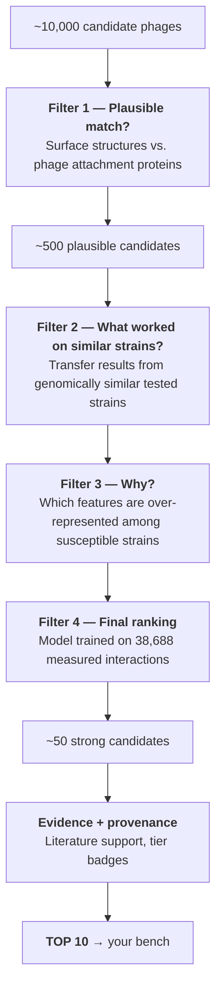

# PhageForge — What We're Building, and What We'd Like You to Check

> **For review by a bench microbiologist / biomedical researcher.**
> No coding background assumed. There is no code in this document. Any technical term is either explained where it appears or in the glossary at the end (§11).
>
> **The part we most need from you is §12.** Everything before it is context so that section makes sense.

---

## 1. The one-paragraph version

PhageForge is a **shortlisting tool for phage screening**. You give it the genome of a bacterial strain whose phage susceptibility nobody has measured yet. It searches everything that is already known — published interaction matrices, thousands of sequenced phage genomes, bacterial surface-structure features, and the published literature — and hands back a ranked list of roughly ten phages that are most likely to infect that strain, each with a stated biological reason and an honest label saying how strong the evidence behind it is. It also proposes a small cocktail chosen so the phages in it don't all bind the same receptor. **It changes the order in which you test things. It does not replace testing.**

---

## 2. The problem, from the bench side

You already know this part; we're stating it so you can check we've framed it correctly.

A new isolate arrives. You want to know which phages in your collection will lyse it. Host ranges are narrow and often strain-specific — a phage that plaques beautifully on one *E. coli* isolate can be completely inert on another isolate of the same species. So the honest answer is a screen, and the screen is combinatorial.

The scale of that combinatorics is well documented. A 2024 *Nature Microbiology* study (Gaborieau et al.) measured **38,688 phage–bacteria pairs — 403 *Escherichia* strains against 96 phages** — to characterise a single genus. That's an enormous amount of bench work for what is, in the scheme of things, a small corner of the problem.

Now scale it up. A biobank with 10,000 phages facing 5,000 uncharacterised strains implies fifty million possible pairings:

```
                          PHAGES  →
              P1     P2     P3     P4    ...   P10,000
   B1     ┌── ?  ─── ?  ─── ?  ─── ? ──────────── ? ──┐
   B2     │   ?      ?      ?      ?               ?  │
   B3     │   ?      ?      ?      ?               ?  │   50,000,000 possible pairs
   ...    │   ?      ?      ?      ?               ?  │      ~40,000 ever measured
   B5000  └── ?  ─── ?  ─── ?  ─── ? ──────────── ? ──┘
```

Every `?` is the question *"does this phage infect this strain?"*, and each one costs bench time. Almost all of them will never be answered. Meanwhile the information that *could* narrow the search — genome databases, published interaction studies, surface-structure typing, the literature — sits fragmented across a dozen separate resources that don't talk to each other.

**That fragmentation is the gap we're filling.**

---

## 3. What we are, and are not, claiming

Stating this up front rather than burying it, because it's the thing most likely to make you distrust the rest.

**We claim:**
- This is **in-silico pre-screening**. It reorders your testing queue so the likely hits come first.
- Every recommendation comes with a reason you can evaluate, and a label saying how good the underlying evidence is.
- We can show, on strains we deliberately hid from the system, how much better than guessing it actually is (§9).

**We do not claim:**
- ❌ Not a diagnostic.
- ❌ Not a treatment recommendation. Nothing here speaks to what should be given to a patient.
- ❌ Not a replacement for plaque assays. The output is a list of things to test, not a result.
- ❌ No claim about *in vivo* efficacy, pharmacokinetics, immune clearance, or dosing.
- ❌ Not rigorous outside the two organisms we have real experimental data for (§6).

If the tool says a phage is a strong candidate and it fails on your plate, the tool was wrong and the plate was right. That ordering is the whole design philosophy.

---

## 4. What you give it, and what you get back

### You give it — either:
- **A genome assembly** (a FASTA file) for a strain you've sequenced, **or**
- **An existing strain ID**, if it's a strain already in the system.

Optionally, you can restrict the search — for example, only virulent phages, or only phages physically present in your own collection.

### You get back:

| Output | What it looks like |
|---|---|
| **Ranked shortlist** | ~10 phages, best candidate first |
| **A reason per phage** | Plain language, e.g. *"This phage infects KL64-capsule strains far more often than chance; your strain is KL64."* |
| **Evidence strength** | A tier badge (Tier 1–4) telling you whether this rests on measured experiments or on computational inference alone |
| **Supporting literature** | Relevant passages from published papers, with DOIs |
| **A suggested cocktail** | Typically 3–4 phages chosen for *complementary* receptor targeting (§7) |
| **A plate layout** | A downloadable 96-well plan for the screen, with controls, ready to pipette |

The shortlist is the product. The plate layout is us trying to make the handoff to the bench as short as possible — and it's one of the things we'd like you to sanity-check.

---

## 5. How it narrows the field — the four filters

This is the core of the pipeline. Ten thousand candidates go in; ten come out. It happens in four stages, and each stage is doing something biologically motivated rather than statistically arbitrary.



### Filter 1 — *Who even looks like a plausible match?*

A phage has to physically attach before anything else can happen. It does that with **receptor-binding proteins** — the proteins on its tail that recognise a specific structure on the bacterial surface. On the bacterial side, those structures are things you already type routinely: the capsule (K-locus), the O-antigen, LPS, certain outer-membrane proteins.

So the first filter asks: *does this phage's attachment protein look like something that binds the surface structures this strain actually has?*

> **The analogy:** it is a key-and-lock shape comparison, run across ten thousand keys at once. We're not simulating the biochemistry — we're asking which keys have a shape resembling keys already known to open locks like this one.

**Why this filter first, and why we're confident in it:** the Gaborieau study's headline finding is that **adsorption factors dominate** — whether the phage can attach explains most of the interaction signal, while antiphage defence systems (restriction-modification, CRISPR, and the newer systems) turned out to play a comparatively marginal role. We built the pipeline around that finding. *If you think that conclusion doesn't generalise beyond Escherichia, that's important — please say so.*

**10,000 → ~500.**

### Filter 2 — *What has worked on similar strains?*

Some strains have been tested. If your strain is genomically very close to a strain that was tested, the results from that strain are informative.

So the second filter finds the most genomically similar strains that **do** have measured results, and carries those results across — weighted by how similar each neighbour actually is. A near-identical strain's results count for much more than a distant relative's.

This is the same logic you'd apply by hand ("this looks like ST258, and we know what works on ST258"), just done systematically against every tested strain at once instead of the two or three you happen to remember.

### Filter 3 — *Why?*

For each surviving phage, we ask: among all the strains this phage is **known** to infect, which bacterial features show up **more often than you'd expect by chance**?

The emphasis matters. We're not reporting what's common — we're reporting what's *enriched*. If a phage infects 22 strains and 18 of them are KL64-capsule, while KL64 is only 61 out of 5,000 strains in the background population, that's a strong, specific signal, and it becomes the sentence you read on the phage card:

> *"This phage infects KL64-capsule strains at far above the background rate. Your strain is KL64."*

This is why every recommendation has a stated reason rather than a bare score. You should be able to read the reason and form your own opinion about whether it's plausible — including deciding we're wrong.

### Filter 4 — *Final ranking*

The survivors are ordered by a model trained on the **38,688 experimentally measured interactions**. It has learned, from real plate data, how to weigh the signals: attachment-protein similarity, capsule and O-antigen match, results from neighbouring strains, whether the phage is virulent or temperate, how broad its known host range is, and so on.

Crucially, the model was **never shown the strains we test it on** (§9).

**~50 → top 10.**

---

## 6. Where the data comes from — and how much to trust each piece

Not all evidence is equal, and we think pretending otherwise would be the fastest way to lose your trust. Every result carries a tier badge:

| Tier | What it means | Where it comes from | Are there negative results? |
|:--:|---|---|:--:|
| **1** | Directly measured, strain by strain | The two published experimental matrices (403 *Escherichia* strains × 96 phages; the Klebsiella matrix) | **Yes** |
| **2** | Curated database record | Established phage–host interaction databases | No |
| **3** | Extracted from published literature | Full-text papers | No |
| **4** | Computational inference only | Attachment-protein similarity alone, no experimental backing | N/A |

### The honest caveat, stated plainly

**Almost all publicly available phage–host records are positives-only and species-level.** They say *"this phage infects Klebsiella pneumoniae"* — not *"this phage infects this particular strain, and fails on that one."*

That matters for two reasons:

1. **Species-level is the wrong resolution for our question.** The entire problem is that strains within a species differ.
2. **Without negative results, you cannot learn to rank.** A model needs to see what *doesn't* work. "We never tested it" is not the same as "it doesn't infect", and treating the blank cells of the matrix as negatives would be a serious methodological error.

Only Tier 1 has real negatives. So **we train and evaluate exclusively on Tier 1**, and that's why we support two organisms rigorously rather than twenty vaguely. Tiers 2–4 are used for retrieval and context — for surfacing candidates and giving you background — but never for training or for the performance numbers we report.

---

## 7. The cocktail feature

A single phage is a fragile intervention. Bacteria acquire resistance readily, and the most common route is the simplest one: **change the receptor**. If the phage can no longer attach, nothing else matters.

Now consider a cocktail of four phages that all bind the same capsule structure. A single mutation altering that capsule escapes **all four at once**. The cocktail was four times the effort and, functionally, one phage.

So when we propose a cocktail, we deliberately pick phages that attach to **different** surface structures — one targeting the capsule, another the O-antigen, another an outer-membrane protein. A strain would need several independent mutations to escape the set, which is far less likely than one.

There's published precedent: Gaborieau et al. showed that cocktails tailored to a strain outperformed generic ones.

> **We'd particularly like your view on this.** Our receptor-class assignment is a *heuristic* — we infer which surface structure a phage targets from its attachment-protein similarity and genome annotations, not from experimental receptor mapping. We know that's approximate. Is it approximate in a way that's still useful, or approximate in a way that would mislead?

---

## 8. A worked example, end to end

**Input:** *Klebsiella pneumoniae*, ST11, KL64 capsule — a clinical isolate, sequenced, never phage-tested.

| Stage | What happens | Count |
|---|---|---:|
| Start | All phages in the system | 10,000 |
| **Filter 1** | Attachment proteins compatible with KL64 capsule / this strain's O-antigen and outer-membrane profile | **~500** |
| **Filter 2** | Results transferred from the 25 most genomically similar *K. pneumoniae* strains that have been tested | ~500 scored |
| **Filter 3** | Enriched features identified per phage → reason strings generated | — |
| **Filter 4** | Ranked by the model trained on measured interactions | **50 → 10** |

**Output — top of the shortlist:**

| # | Phage | Why | Evidence |
|:--:|---|---|:--:|
| 1 | vB_KpnP_A | Carries a capsule depolymerase; infects 18/22 known KL64 strains (KL64 is 61/5,000 in background) | **Tier 1** |
| 2 | vB_KpnM_B | Infected 4 of the 5 nearest tested strains, all ST11 | **Tier 1** |
| 3 | vB_KpnP_C | Attachment protein closely resembles that of phage A; no direct test on KL64 | Tier 4 |
| 4 | vB_KpnS_D | Reported active against ST11 in a 2023 paper (DOI shown) | Tier 3 |
| … | | | |

**Proposed cocktail:** vB_KpnP_A *(capsule)* + vB_KpnM_B *(LPS)* + vB_KpnS_D *(outer-membrane protein)* — three different receptors, so no single mutation escapes the set.

**Plate layout:** a 96-well plan covering all 10 shortlisted phages across a dilution series, with positive and negative controls, exportable as a spreadsheet.

Notice that candidate #3 rests on computational similarity alone (Tier 4) while #1 rests on measured data (Tier 1). Both are shown; the badge is what lets you decide how much weight to give each. **We'd like to know whether you'd want the Tier 4 candidates shown at all, or filtered out by default.**

---

## 9. How we'll know whether it actually works

This is the part we consider most important, and the number we'll be judged on.

We take strains that **do** have complete measured results, and we hide them from the system entirely — the model never sees them during training. Then we ask the system to predict them cold, and compare its top 10 against what the plates actually showed.

The headline question: **of the 10 phages we recommend, how many are genuine hits?**

We compare against three reference points, because "better than nothing" isn't a meaningful claim:

| We compare against | Why this comparison matters |
|---|---|
| **Random selection** | The floor. How many hits do you get picking 10 phages blindly? |
| **The most generalist phages** | The strong, dumb strategy: always recommend the broadest-host-range phages. If we don't clearly beat this, we haven't learned anything strain-specific — we've just rediscovered which phages are promiscuous. |
| **Nearest tested strain** | What an experienced microbiologist would do by hand: find the most similar strain that was tested, copy its results. |

If random gets 1 hit in 10 and PhageForge gets 7, that is the result. If PhageForge only matches the generalist baseline, we'll say so — that outcome is worth knowing too.

We also report results **separately for each organism**, since generalising from *Escherichia* to *Klebsiella* is a claim that needs its own evidence.

---

## 10. Limitations we already know about

Listed so you can add the ones we've missed:

1. **Two organisms only.** *Escherichia* and *Klebsiella pneumoniae* — the only ones with strain-level experimental matrices containing negative results. Everything else is browse-and-explore, labelled as such.
2. **Negative results are scarce.** Discussed in §6. It's the binding constraint on the whole project.
3. **Temperate phages.** Currently down-ranked rather than excluded. We're genuinely unsure this is right — see §12.
4. **No *in vivo* prediction.** Everything here is about whether a phage can infect a strain in vitro. Nothing about animal models, human infection, immune clearance, or pharmacology.
5. **Receptor assignment is inferred, not measured.** §7. A known soft spot.
6. **Defence systems are underweighted** — because the published analysis found them marginal. If that's wrong for organisms beyond *Escherichia*, our pipeline inherits the error.
7. **Efficiency of plating isn't binary.** We currently reduce interactions to infects / doesn't infect, and we suspect that's a simplification you'll object to (§12).
8. **Database bias.** Well-studied strains and phages are over-represented in every source we use. Recommendations will skew toward the well-characterised.

---

## 11. Glossary

| Term | Plain meaning |
|---|---|
| **Receptor-binding protein (RBP)** | The protein on a phage's tail that recognises and attaches to a structure on the bacterial surface. The lock-and-key step. |
| **Embedding** | A way of turning a protein sequence into a list of numbers, such that proteins with similar structure and function end up with similar numbers. It lets a computer compare thousands of proteins quickly. |
| **Vector / similarity search** | Searching by *resemblance* rather than by exact match — "find me the 300 proteins most similar to this one" — across millions of entries in milliseconds. |
| **Ranking model** | A program that learned from real measured data how to order candidates best-first. It doesn't follow rules we wrote; it learned the weightings from the 38,688 measured interactions. |
| **EOP (efficiency of plating)** | The ratio of plaque-forming units on a test strain versus a reference host — a quantitative measure of how well a phage grows on a given strain. |
| **Held-out set** | Data deliberately hidden from the model during training, used afterwards to test it honestly. The equivalent of a blinded control. |
| **Tier (1–4)** | Our label for evidence strength — Tier 1 is directly measured, Tier 4 is computational inference alone. |
| **K-locus** | The genomic region encoding the capsule; determines capsule type (e.g. KL64). A major phage receptor in *Klebsiella*. |
| **Set-cover** | The mathematical shape of the cocktail problem: choose the smallest set of phages that covers the most escape routes. |

---

## 12. ⭐ What we'd like from you

This is the actual point of the document. You don't need to comment on anything technical — we need the **biology and the experimental design** checked by someone who has run these screens.

### On the features we use

1. **Are we extracting the right bacterial features?** We use capsule type (K-locus), O-antigen, LPS genes, outer-membrane proteins, MLST/sequence type, and antiphage defence systems. **Is there an obvious determinant of phage susceptibility we've left out?**

2. **Is it defensible to build the whole pipeline around adsorption?** We've leaned hard on the Gaborieau finding that attachment dominates and defence systems are marginal. Does that match your experience, and would you expect it to hold in *Klebsiella* as well as *Escherichia*?

### On how we define a "hit"

3. **What EOP threshold should count as infection?** We currently reduce everything to a binary infects / doesn't-infect call. **Is a binary call even appropriate**, or does collapsing EOP destroy information you'd need? Would you rather see a predicted EOP range, or a three-way call (strong / weak / none)?

4. **How should we treat lysis-from-without and other false positives on spot assays?** Our Tier 1 sources use different assay types and we're currently treating them as comparable. Is that safe?

### On the recommendations themselves

5. **Is the evidence tiering sensible** to a working microbiologist — or are Tiers 2 and 3 so weak that showing them at all is misleading? Would you want Tier 4 (computational-only) candidates hidden by default?

6. **Is the shared-receptor cocktail logic sound, or too naive?** Is receptor diversity really the dominant consideration, or would you weight something else more heavily — burst size, host range breadth, known synergy, avoidance of lysogeny?

7. **Should temperate phages be excluded outright, or just down-ranked?** We currently down-rank them and keep them visible. We can see arguments both ways and would rather follow your judgement.

### On trust and usability

8. **What would make you actually trust — or immediately distrust — a shortlist like this?** If you opened this tool tomorrow, what would you look for first to decide whether it was worth your time? What single output would make you close the tab?

9. **Would the plate layout match how you'd really run the screen?** Dilution series, controls, replicate structure, plate count. Where does it not match reality?

10. **Is the reason string useful, or is it false comfort?** When we tell you *"this phage infects KL64 strains far above background rate"* — does that help you judge the recommendation, or does it just make a weak prediction sound authoritative?

### The blunt one

11. **Would this actually save you time?** Or is the real bottleneck somewhere else entirely — phage availability, propagation, assay throughput, regulatory constraints — such that reordering the testing queue solves a problem you don't have?

We'd genuinely rather hear "this doesn't help" now than build it and find out later.

---

## 13. Proposed architecture

Reference material, not required reading — but if you want to know what we're actually building rather than just what it does, this is the shape of it. Still no code.

### The one term you need

The whole system is built on a **search engine** — the same category of software that powers site search, not a database of the sort you'd query with a spreadsheet. The important property: it can answer *"find me the things most similar to this"* across millions of records in well under a second, which is exactly the question Filter 1 asks.

### Three parts

The system splits into work done **once, in advance** (slow, heavy, scheduled) and work done **per question** (fast, must return while you wait). Almost all the expensive computation lives in the first part, which is why a prediction comes back in about two seconds rather than overnight.

**Part 1 — Preparation, done in advance.**
We collect the raw material (the two published interaction matrices, ~30,000 sequenced phage genomes, bacterial assemblies, open-access literature) and run each through standard bioinformatics tools to extract what matters: capsule typing (Kaptive), sequence type (MLST), O-antigen and LPS, defence systems (DefenseFinder), phage lifestyle (BACPHLIP), attachment proteins (PhageRBPdetect), depolymerases. Nothing here is novel — these are the same tools you'd run yourself. Finally, every attachment protein and bacterial surface protein is converted into a numerical fingerprint (an *embedding*) so structurally similar proteins get similar numbers. This is the most computationally expensive step, and the reason the preparation phase exists.

**Part 2 — The library.**
Six cross-referenced collections: phages (~30,000), bacterial strains, measured interactions (~40,000), proteins and their fingerprints, literature, and an audit trail of past predictions. Today these live in a dozen separate resources that don't reference each other — you cannot ask a single question spanning a genome database, an interaction matrix and the literature. Here they share one set of identifiers, so you can. **This is the thing that doesn't currently exist.**

**Part 3 — The funnel.** The four filters from §5, plus evidence gathering and cocktail design. Each filter is a single query against the library rather than a separate program — no pipeline of scripts to break, and each stage records what it did.

**Part 4 — How you reach it.** A web interface (search or upload, watch the funnel narrow, export the plate layout); a plain-English question box (*"which phages infect ST11 Klebsiella with KL64 capsule?"*); and a programmatic interface for running a few hundred strains at once.

### What happens when you submit a strain

1. You upload a genome assembly, or pick a strain already in the library.
2. **If it's a new genome:** we check assembly quality first and reject it with a clear reason if too fragmented to type reliably. Then the same feature extraction as Part 1, plus protein fingerprinting. Minutes, not seconds — runs as a background job.
3. **Filter 1.** The library is searched three ways at once — overall genome similarity, attachment-protein-to-receptor compatibility, keyword match on annotations — and the three lists are merged. Three independent signals means a phage missed by one can still be caught by another. **10,000 → ~500.**
4. **Filter 2.** The 25 most genomically similar strains with real measured results are found, and their outcomes pooled, weighted by similarity.
5. **Filter 3.** Per surviving phage, which bacterial features are over-represented among strains it's known to infect — this produces the reason sentence.
6. **Filter 4.** The trained ranking model reorders the survivors. **~500 → 50 → 10.**
7. **Evidence.** Literature passages supporting or contradicting each of the final ten, with DOIs.
8. **Cocktail.** 3–4 phages targeting different receptors (§7), plus the plate layout.
9. The whole run is recorded — inputs, each stage's counts, final ranking, model version — so it can be audited or reproduced.

### Why a search engine, rather than building a predictive model?

This is the design decision we'd most like challenged, because it rests on a biological claim rather than a technical one.

The obvious approach would be to train one large model taking a phage and a bacterium and outputting a probability. Two published groups have already done versions of that, and done them well — we'd be rebuilding their work with less data.

Instead we've treated the central question as a **matching problem**. If adsorption really does dominate — if "will this phage infect this strain" is mostly "can this phage's attachment protein bind this strain's surface" — then it is fundamentally a question about *resemblance*: which of these ten thousand attachment proteins look like ones already known to bind structures like this one? Search engines are built to answer resemblance questions at scale. That is the whole argument.

> **Which means the architecture inherits the biology's risk.** If adsorption is less dominant than the *Escherichia* work suggests — or dominant in *Escherichia* but not *Klebsiella* — we've optimised the system around the wrong thing, and no amount of engineering fixes that. Same concern as question 2 in §12, and why we're asking.

### What we deliberately kept out

- **No prediction of anything downstream of infection** — no burst size, lysis kinetics, or *in vivo* behaviour.
- **No automatic updating from new literature.** Papers enter on a controlled refresh, not continuously — we'd rather results be reproducible than current.
- **No treatment logic of any kind.** The system has no concept of a patient, a dose, or a route.
- **No re-annotation of genomes.** Existing tools do this better; we use their output rather than competing.

---

## 14. Background reading

If you want the primary sources:

- **Gaborieau et al. (2024)**, *Prediction of strain-level phage–host interactions across the Escherichia genus*, **Nature Microbiology** — the 403 × 96 matrix and the adsorption finding. [Link](https://www.nature.com/articles/s41564-024-01832-5)
- **Boeckaerts et al. (2024)**, *Prediction of Klebsiella phage–host specificity at the strain level*, **Nature Communications** — the Klebsiella matrix and the capsule/RBP approach. [Link](https://www.nature.com/articles/s41467-024-48675-6)
- **Phage biobanks as enabling infrastructure for precision phage therapy** — the operational gap we're addressing. [Link](https://pmc.ncbi.nlm.nih.gov/articles/PMC12933349/)
